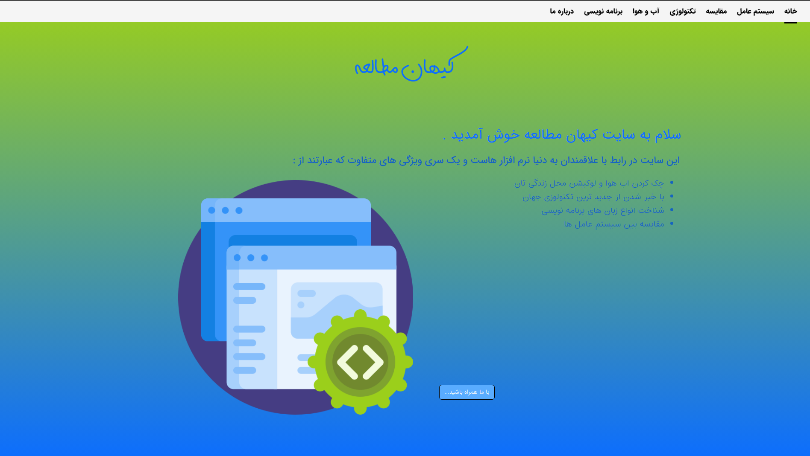
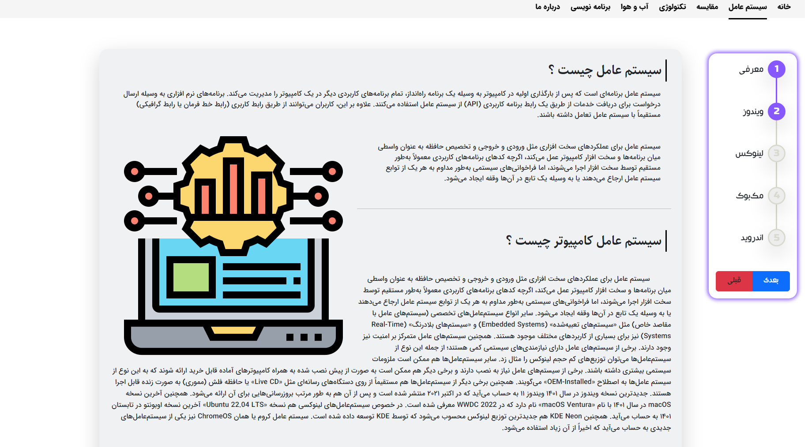
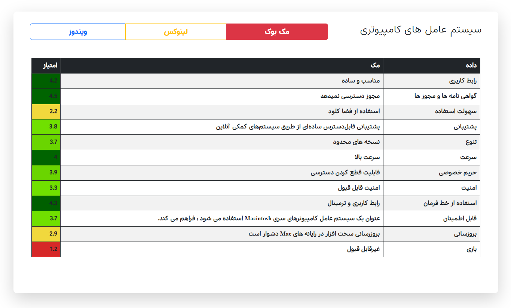
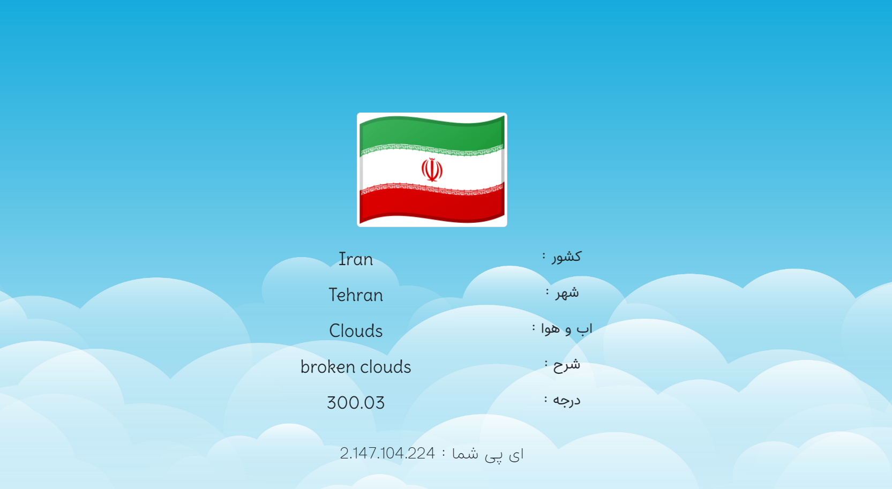

# KeyhaniStudy

<h2>Project create a website about new technology.</h2>

<h3>What is on !</h3>

<ul>
    <li>Get new technology</li>
    <li>Realize all of systemOperations get disadvantages ,benefit about them</li>
    <li>Compare between systemOperations</li>
    <li>Get your location and weather</li> 
    <li>What is Programming , exactly ?</li>
</ul>

    <h3>what packages was used there ?</h3>
    <ul>
        <li>Bootstrap</li>
        <li>FontAwesome</li>
        <li>Jquery</li>
        <li>OwlCarousel</li>
    </ul>

    <h3>Looking around KeyhaniStudy</h3>
    <h4>Main Page</h4>
    
    

    <h4>SystemOperation page</h4>
    
    <h4>Compare page</h4>
    
    <h4>Weather page</h4>
    

 
